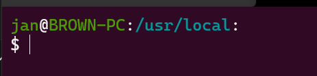

# Ganti Baris Bash Terminal

- Copy baris berikut di bagian akhir file `~\.bashrc`

    ```
    export PS1="\[\033[38;5;2m\]\u\[$(tput sgr0)\]@\[$(tput sgr0)\]\[\033[38;5;2m\]\h\[$(tput sgr0)\]:\[$(tput sgr0)\]\[\033[38;5;6m\]\w\[$(tput sgr0)\]:\n\\$ \[$(tput sgr0)\]"
    ```

- Maka tampilan terminal akan menjadi:

    
